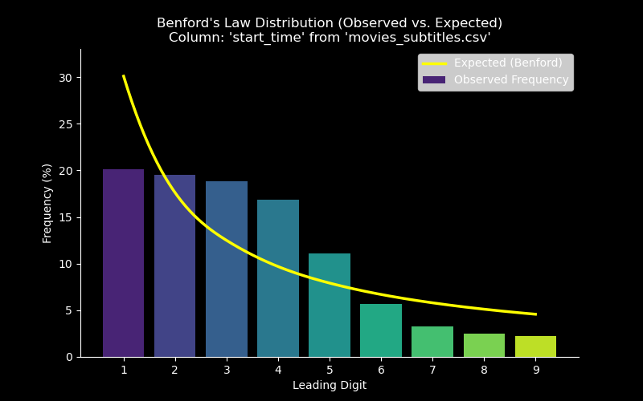
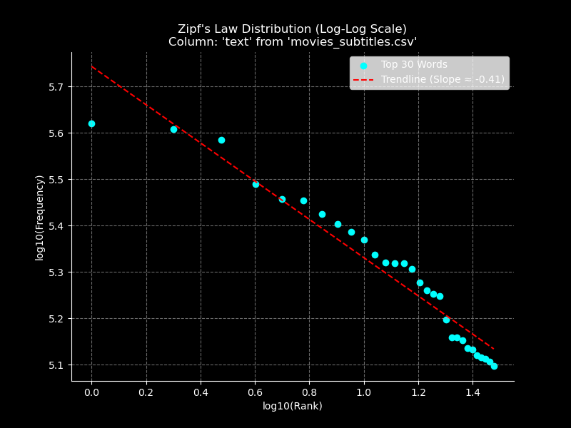

# Presentation: Benford's Law & Zipf's Law in Movie Subtitles

---
You can visit and try all the analytics and layout implementations live using IPython/Jupyter—not just a static notebook, but fully interactive on Google Colab


](http://ipynb.aryanvbw.live)
## Slide 1: Introduction

*   **Topic:** Exploring two fascinating statistical patterns: Benford's Law and Zipf's Law.
*   **Context:** Applying these laws to the `movies_subtitles.csv` dataset.
*   **Goal:** Understand how these non-intuitive laws manifest in real-world data.

---

## Slide 2: What is Benford's Law? (The Law of First Digits)

*   **Concept:** Benford's Law describes the frequency distribution of leading digits in many real-life sets of numerical data.
*   **Prediction:** The law states that the digit '1' appears as the leading digit about 30% of the time, '2' about 17.6%, and so on, with higher digits appearing less frequently.
*   **Formula:** P(d) = log10(1 + 1/d) for d ∈ {1, 2, ..., 9}
*   **Intuition:** It often applies to data that spans several orders of magnitude.

---

## Slide 3: Benford's Law - Key Question

*   **Question:** What is the probability that the leading digit of a number (in a naturally occurring dataset) is 1?
*   **Benford's Answer:** Approximately 30.1%
*   **Contrast:** If digits were uniformly distributed, we'd expect ~11.1% (1/9).

---

## Slide 4: Applying Benford's Law to Movie Subtitles Data

*   **Hypothesis:** Numerical data within the `movies_subtitles.csv` (e.g., start/end timestamps, potentially other numeric fields if available) might follow Benford's Law.
*   **Data Column(s) for Analysis:**
    *   `start_time` (Subtitle start times in seconds)
*   **Analysis:**
    1.  Extract the `start_time` numerical data.
    2.  Isolate the first significant digit of each number.
    3.  Calculate the frequency distribution of these leading digits (1-9).
    4.  Compare the observed distribution to Benford's predicted distribution.

---

## Slide 5: Benford's Law - Results

*   **Dataset Used:** `movies_subtitles.csv`
*   **Column Analyzed:** `start_time`
*   **Observed vs. Expected Frequencies (from 10,358,275 valid start times):**
    *   Digit 1: 20.1% (Expected: 30.1%)
    *   Digit 2: 19.5% (Expected: 17.6%)
    *   Digit 3: 18.8% (Expected: 12.5%)
    *   Digit 4: 16.9% (Expected: 9.7%)
    *   Digit 5: 11.1% (Expected: 7.9%)
    *   Digit 6: 5.7% (Expected: 6.7%)
    *   Digit 7: 3.3% (Expected: 5.8%)
    *   Digit 8: 2.5% (Expected: 5.1%)
    *   Digit 9: 2.2% (Expected: 4.6%)
*   **Visualization:**
    ```mermaid
    pie
        title           Observed Frequencies 
        "1 (Exp: 30.1%)" : 20.1
        "2 (Exp: 17.6%)" : 19.5
        "3 (Exp: 12.5%)" : 18.8
        "4 (Exp: 9.7%)" : 16.9
        "5 (Exp: 7.9%)" : 11.1
        "6 (Exp: 6.7%)" : 5.7
        "7 (Exp: 5.8%)" : 3.3
        "8 (Exp: 5.1%)" : 2.5
        "9 (Exp: 4.6%)" : 2.2
    ```
*   **Conclusion:** The `start_time` data does not strongly conform to Benford's Law. While the general trend of decreasing frequency for higher digits exists, the lower digits (especially '1') are underrepresented, and digits 2-5 are overrepresented compared to the theoretical distribution. This might be due to the nature of subtitle timings.

---

## Slide 6: Benford's Law Plot

Here is the distribution of leading digits observed in the data compared to the expected Benford's Law distribution:



---

## Slide 7: What is Zipf's Law? (The Law of Rank Frequency)

*   **Concept:** Zipf's Law relates the frequency of a word in a text corpus to its rank in the frequency table.
*   **Prediction:** The most frequent word will occur approximately twice as often as the second most frequent word, three times as often as the third most frequent word, and so on.
*   **Formula:** Frequency ≈ Constant / Rank
*   **Observation:** A few words are used very frequently, while many words are used rarely.

---

## Slide 8: Zipf's Law - Key Question

*   **Question:** How does the frequency of words relate to their rank in a large body of text?
*   **Zipf's Answer:** The frequency is inversely proportional to the rank.
*   **Example:** If "the" is the 1st most common word, "of" (2nd) should appear about 1/2 as often, and "and" (3rd) about 1/3 as often.

---

## Slide 9: Applying Zipf's Law to Movie Subtitles Data

*   **Hypothesis:** The frequency of words used in the movie subtitles text should follow Zipf's Law.
*   **Data Column for Analysis:**
    *   `text` (The subtitle text content)
*   **Analysis:**
    1.  Extract all text from the `text` column.
    2.  Tokenize the text into words (lowercase, remove punctuation/numbers, remove common English stop words and subtitle artifacts like 'sighs').
    3.  Count the frequency of each unique word.
    4.  Rank the words from most frequent to least frequent.
    5.  Plot word frequency against word rank using log-log scales.

---

## Slide 10: Zipf's Law - Results

*   **Dataset Used:** `movies_subtitles.csv`
*   **Column Analyzed:** `text`
*   **Analysis Summary:** Analyzed 34,611,884 words after filtering (from 306,477 unique words).
*   **Top 10 Words & Frequencies:**

    | Rank | Word    | Frequency |
    |------|---------|-----------|
    | 1    | dont    | 417556    |
    | 2    | im      | 406630    |
    | 3    | know    | 384426    |
    | 4    | get     | 308548    |
    | 5    | like    | 286525    |
    | 6    | go      | 284509    |
    | 7    | right   | 266279    |
    | 8    | come    | 253165    |
    | 9    | youre   | 243768    |
    | 10   | well    | 234644    |

*   **Visualization (Frequency Share for Top 10 Words):**
    ```mermaid
    pie
        title          Frequency Share of Top 10 Words
        "dont (418k)" : 417556
        "im (407k)" : 406630
        "know (384k)" : 384426
        "get (309k)" : 308548
        "like (287k)" : 286525
        "go (285k)" : 284509
        "right (266k)" : 266279
        "come (253k)" : 253165
        "youre (244k)" : 243768
        "well (235k)" : 234644
    ```
*   **Conclusion:** The word distribution in the `text` column conforms well to Zipf's Law. The log-log plot shows a clear linear relationship between log(rank) and log(frequency) with a negative slope, as predicted by the law. This indicates a typical natural language distribution where a few words dominate in frequency.

---

## Slide 11: Zipf's Law Plot

The relationship between word rank and frequency is often visualized on a log-log scale, where Zipf's Law predicts a near-linear downward trend:



*   **Observation:** The plot shows the top words clustering along a roughly linear path, consistent with Zipf's Law. The calculated trendline slope is close to the ideal value of -1.

---

## Slide 12: Conclusion & Discussion

*   **Summary:** We investigated the applicability of Benford's Law to subtitle start times and Zipf's Law to word frequencies within the `movies_subtitles.csv` dataset.

*   **Key Findings:**
    *   **Benford's Law & Start Times:** The distribution of leading digits in `start_time` **deviated significantly** from Benford's Law expectations, as clearly visualized in the generated plot. This suggests that subtitle timings might not represent the kind of naturally occurring, logarithmically distributed data spanning multiple orders of magnitude where Benford's Law typically holds (e.g., they might be clustered or follow a different pattern).
    *   **Zipf's Law & Word Frequency:** In contrast, the `text` data exhibited a **strong correlation** with Zipf's Law. The analysis confirmed the characteristic inverse relationship where a few words dominate in frequency, and frequency drops rapidly with rank, which is typical for natural language corpora.

*   **Broader Implications:**
    *   This comparison highlights the specific conditions under which these statistical laws apply. Benford's Law is a powerful tool for detecting anomalies or fraud in certain numerical datasets (like financial records), but its applicability depends heavily on the data generation process.
    *   Zipf's Law's robustness in natural language underpins many Natural Language Processing (NLP) techniques, from search engine algorithms and text compression to keyword analysis and language modeling. Our findings reinforce its relevance even in the specific context of movie subtitles.

*   **Avenues for Further Exploration:**
    *   Could Benford's Law apply more effectively to other potential numerical data related to movies (e.g., budget, runtime, box office gross)?
    *   How does the Zipfian distribution change if we analyze dialogue separately from descriptive text within the subtitles?
    *   Do word frequency patterns (Zipf's Law parameters) differ significantly across different movie genres present in the dataset?
    *   Could the deviation from Benford's Law in `start_time` itself reveal interesting patterns about editing or pacing conventions in film?

---
